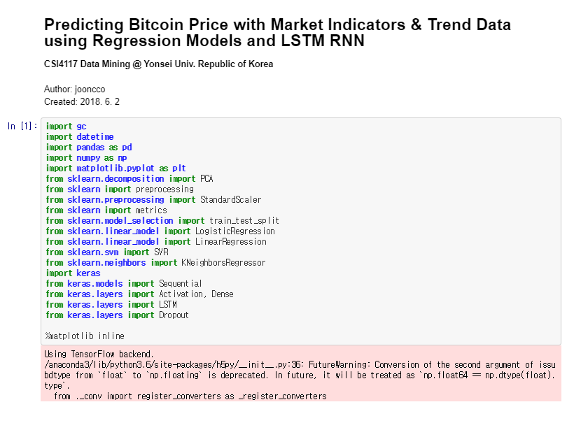
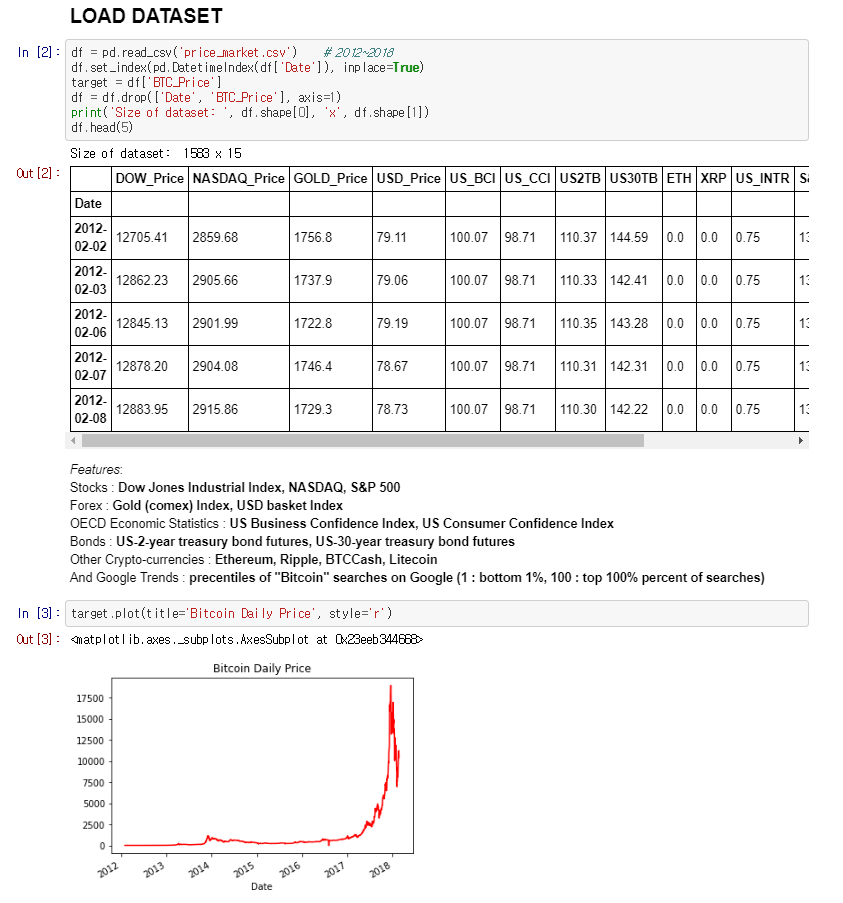
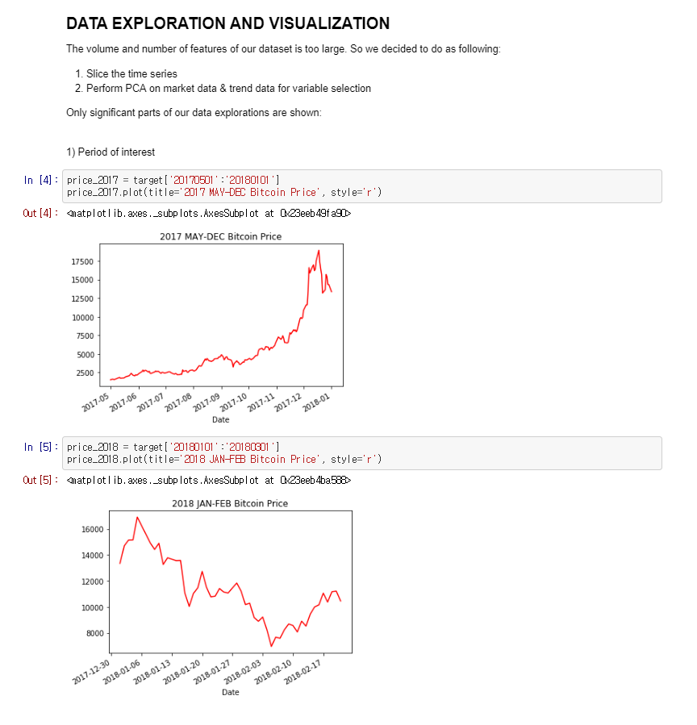

# <i>bitcoin-price-predictor</i>
Project for bitcoin price prediction with market indicators and trend data(Google trend) using <b>Regression Models & LSTM RNN.</b> <b><i>CSI4117 Data Mining cource @Yonsei Univ, Seoul, Republic of Korea.</i></b>

# Snapshot

...
<i>(omitted)</i>
# References
1) Data & Linear Regression:
https://www.kaggle.com/acornec/bitcoin-predictions
2) Data Exploration:
https://github.com/anvithaananth/bitcoin_marketprice_prediction/blob/master/project1_bitcoin_final_submission.ipynb
3) PCA:
https://towardsdatascience.com/pca-using-python-scikit-learn-e653f8989e60
4) Regression Models:
https://towardsdatascience.com/logistic-regression-using-python-sklearn-numpy-mnist-handwriting-recognition-matplotlib-a6b31e2b166a
https://github.com/mGalarnyk/Python_Tutorials/blob/master/Sklearn/PCA/PCA_to_Speed-up_Machine_Learning_Algorithms.ipynb
5) RNN:
https://medium.com/@siavash_37715/how-to-predict-bitcoin-and-ethereum-price-with-rnn-lstm-in-keras-a6d8ee8a5109
